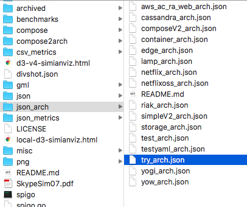
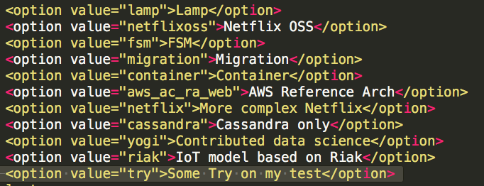
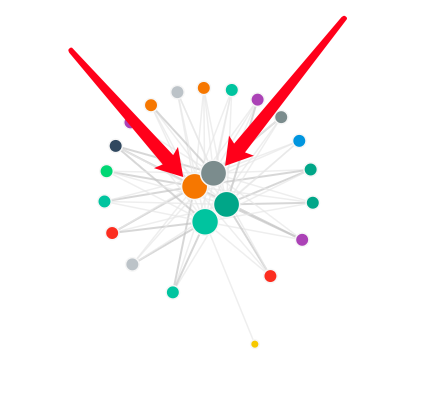
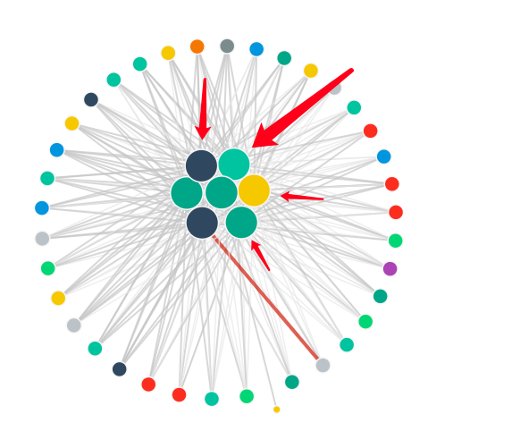
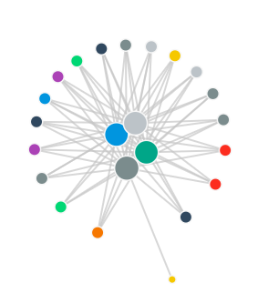
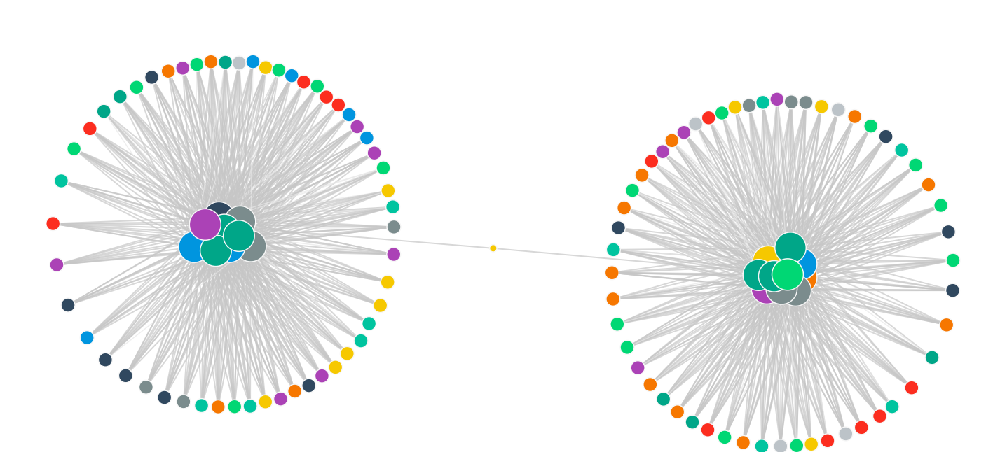
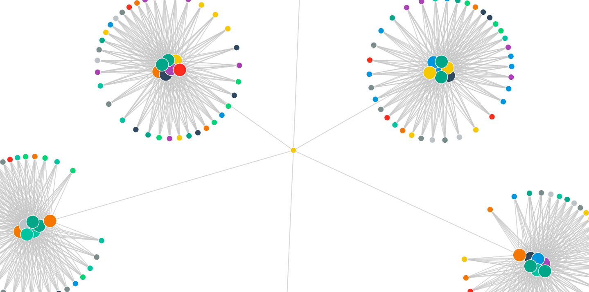
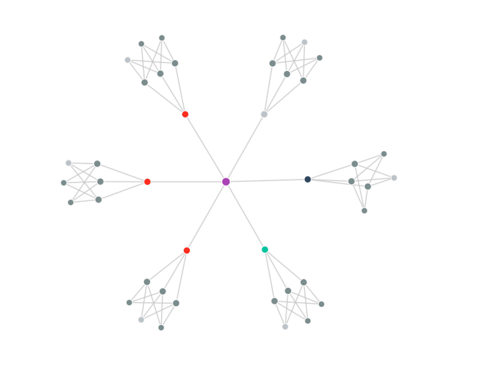

# Spigo使用说明

碎碎念
====

- 在微服务架构中，有非常多的节点需要我们去搭建。我们不可能一个一个的去搭建这些节点，因此需要一个工具去模拟这些节点。spigo就是一个可以模拟节点拓扑的一个工具。
- 网上没有任何关于spigo的教程，而且github上spigo的readme文档写的并不是特别详细，有几个比较重要的步骤没有po出来，于是写一个使用说明来记录一下，方便自己和其他想要使用这个软件的其他人。因为我第一次接触go写的项目，也是第一次接触分布式系统的架构，所以涉及到的概念可能说明的不准确，所以欢迎大家纠错补充。
- 再说明一点，我实在mac os下运行的spigo，所以一些配置可能需要结合自己系统去搞一搞。

正文
====

spigo安装
-----

- **spigo的开发者其实已经帮我们把spigo这个项目给build好了，我们只要在github上面下载下来就能直接用了。**

- **下面说一下我在研究spigo用法的时候得到的其他安装方法：**

  - 因为spigo是用go写的，所以我就顺便把go给装了。但其实不安装go的话也是可以运行的...
    - 安装go的话，我们在安装之后需要把环境变量GOPATH和GOROOT给设置了，这两个的含义网上应该有介绍，这里不细讲。如果不设置GOPATH的话，我们是使用不了go get XX这个命令的。
  - 为什么会想要自己build呢？是因为我在研究他的源码的时候，发现源码里面import的很多文件路径其实都是github.com/adrianco/这样的前缀，于是我用go命令运行它的一些test的时候经常报错，本着一劳永逸的想法我就想找一个办法解决掉这些报错。于是我就查了一下其他go项目的部署方法，最后找到了一些go项目build的普遍方法：

  ```go
  go get -u github.com/adrianco/spigo
  cd {{replace your gopath}}/src/github.com/adrianco/spigo
  go install 或者 go build
  ```

  ​	这样再去运行它的一些test是不会报错的。当然你也可以直接把下好的spigo按照他的路径名嵌套的放到文件夹里面。

本地UI安装
----

- 如果我们想要运行自己定义的arch的话，我们必须安装本地UI。

- 在安装之前我们必须确保自己安装了npm这个包管理工具。没有的话就自己安装一下。

- 然后进入spigo目录里面

  ```shell
  $ cd ui
  $ npm install
  $ npm run dev
  ```

- 这样就开启了本地UI，然后在浏览器中登录localhost:8000,就能进入simianviz界面，也就是它的UI界面。

使用NEO4J持久化arch
----

- neo4j是一个用json写的一个图形数据库，我们可以选择把我们自定义的架构加载到neo4j上面持久化。

- 首先确保自己安装了neo4j并且可以使用。

- 如果想要用neo4j记录netflix架构的话，我们可以直接它的命令参数-n。具体命令如下：

  ```
  $ ./spigo -a netflix -n
  ```

- 最后在浏览器中登录localhost:7474就能看到neo4j记录的自定义arch了。

如何使用spigo模拟自定义arch
------
- 在github的readme文件中，并没有记录如何使用spigo来模拟我们自定义的arch。直到我看了spigo在github中的issue，有人和我有一样的问题。

  

- 首先，我们先将自定义的arch放在json_arch文件夹中。此处应该注意文件名的格式。这里以try_arch.json为例。

  

- 然后打开ui/js/toolbar/index.js文件，这个文件的作用大概是ui的目录吧。在该文件的最后添加自己定义的arch的名字。

  

- 最后重新打开本地ui即可。

  ```
  $ npm run dev
  ```

spigo命令参数说明
----

- 这里要说明的一点就是，我们使用spigo加载不同的arch，最后都会生成对应的json文件，存放在json文件夹中。可以在json文件夹中被找到！

- -a：后面指定架构的名字就能加载对应的架构，比如：

  ```
  $ ./spigo -a netflixoss
  ```

- -c,-g,-j：这几个好像都是起到记录的作用。可以去看看spigo的readme，上面讲的清楚。

- -n：就是把架构拓扑给加载到neo4j上。

- -p：默认是100。他大概的作用就是指明属性中region=1的每个节点的倍数。

  - 比如在lamp文件中定义了mysql节点数量count=2。

    

  - 当-p=100时，spigo模拟的lamp架构中sql节点个数为2,箭头所示:

    

  - 当-p=200时，spigo模拟的lamp架构中的sql节点就变成了4个，箭头所指：

  

- -w：就是将整个拓扑图复制多份。默认为1。图示说明：

  - 原拓扑中定义www只连着一个webserver_elb。

  

  - -w=1:

  

  - -w=2:同样的拓扑被复制多了一份，www连了两个webserver_elb。

  

- -f:将多个相同性质的节点归结在一起，简化拓扑。对比效果：

  - 不使用-f：

  

  - 使用-f：

  

### 好的工具

####解析

- 突然发现了spigo提供了一个解析compose变成arch的json文件的工具。但是很多服务都解析不了，比如rabbitmq这样的消息队列。
- **可能需要自己改代码**，使用方法等改完代码再说。
- 除了需要改代码之外，他生成的arch文件，似乎无法通过spigo来生成flow数据，因为arch文件中必须按照一定的依赖顺序。

####模拟微服务

- spigo可以模拟微服务行为，然后获取tracing 数据。

####模拟异常

- 在tools中看到了chaos monkey，不知道是否可以通过chaos monkey来模拟异常。

### 一些问题

- mac下运行正常，但是到了windows下会出现tracing 数据中的时间戳不正确的问题。
- 在加了记录flow文件的参数-j时，模拟时间太长spigo会卡住....